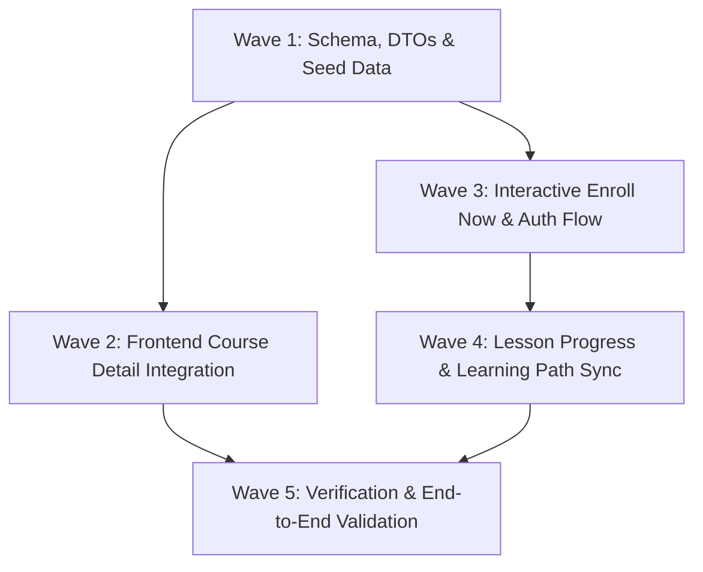

# Phase 05: Course Metadata Enrichment, Enrollment Flow & Course Progress Tracking

**Phase Status:** Ready for Execution  
**Goal:** Synchronize the updated Course model fields (`about`, `outcomes`, `skills`, `tools`) across backend services and database, wire them up to the synthesized Course Detail frontend, implement a seamless "Enroll Now" registration/enrollment journey, and wire up live lesson progress tracking.

---

## 1. Context & Architecture Overview

In [`prisma/schema.prisma`](file:///e:/Repository/chhaigaon_udyami/chhaigaon_udyami/prisma/schema.prisma#L163-L166), the `Course` model includes:
```prisma
  about       String?
  outcomes    String[] @db.Text
  skills      String[] @db.Text
  tools       String[] @db.Text
```

Currently:
1. **Database & Seed**:
   - `prisma/seed.ts` does not yet populate `about`, `outcomes`, `skills`, `tools` for the 12 seeded courses.
   - Fallback `MOCK_COURSES_DATA` in [`app/courses/[slug]/page.tsx`](file:///e:/Repository/chhaigaon_udyami/chhaigaon_udyami/app/courses/[slug]/page.tsx) uses alternate property keys (`learnings`, `skillsGained`, `toolsLearned`, `shortDesc`) rather than the standardized schema fields.
2. **DTOs & Controllers**:
   - [`lib/schemas/course.schema.ts`](file:///e:/Repository/chhaigaon_udyami/chhaigaon_udyami/lib/schemas/course.schema.ts) and [`services/course.service.ts`](file:///e:/Repository/chhaigaon_udyami/chhaigaon_udyami/services/course.service.ts) do not validate or save `about`, `outcomes`, `skills`, `tools` during `createCourse` or `updateCourse`.
3. **Frontend Integration**:
   - [`components/course/course-detail-tabs.tsx`](file:///e:/Repository/chhaigaon_udyami/chhaigaon_udyami/components/course/course-detail-tabs.tsx) has a tab for `विवरण (About)` (`#about`), but [`app/courses/[slug]/page.tsx`](file:///e:/Repository/chhaigaon_udyami/chhaigaon_udyami/app/courses/[slug]/page.tsx) skips directly to `#outcomes` without rendering an `<section id="about">`.
   - The UI does not bind `dbCourse.outcomes`, `dbCourse.skills`, or `dbCourse.tools` dynamically.
4. **Enrollment & Progress Flow**:
   - "Enroll Now" and "Free Enroll" buttons currently link statically to `<Link href="/apply">`.
   - They need to dynamically call [`POST /api/enrollments`](file:///e:/Repository/chhaigaon_udyami/chhaigaon_udyami/app/api/enrollments/route.ts) for authenticated users or route to `/login` / `/register` with post-login redirect & auto-enrollment.
   - Enrolled users must see "अध्ययन जारी रखें (Continue Learning)" and be able to mark lessons complete, syncing progress via [`POST /api/progress`](file:///e:/Repository/chhaigaon_udyami/chhaigaon_udyami/app/api/progress/route.ts).

---

## 2. Work Breakdown & Implementation Waves



### Wave 1: Schema, DTOs & Seed Data Synchronization
- **Task 1.1: Update Course DTOs & Zod Schemas**
  - File: [`lib/schemas/course.schema.ts`](file:///e:/Repository/chhaigaon_udyami/chhaigaon_udyami/lib/schemas/course.schema.ts)
  - Add `about: z.string().optional().nullable()`, `outcomes: z.array(z.string()).default([])`, `skills: z.array(z.string()).default([])`, `tools: z.array(z.string()).default([])` to `CreateCourseSchema` and `UpdateCourseSchema`.
- **Task 1.2: Update Course Backend Service & API**
  - File: [`services/course.service.ts`](file:///e:/Repository/chhaigaon_udyami/chhaigaon_udyami/services/course.service.ts)
  - Ensure `createCourse` and `updateCourse` persist `about`, `outcomes`, `skills`, `tools`.
  - Ensure queries (`getPublishedCourses`, `getFilteredCourses`, `getCourseBySlug`, `getCourseById`) include these fields.
- **Task 1.3: Update Seed Script with 12 Enterprise Courses Data**
  - File: [`prisma/seed.ts`](file:///e:/Repository/chhaigaon_udyami/chhaigaon_udyami/prisma/seed.ts)
  - Add rich `about`, `outcomes`, `skills`, and `tools` to all 12 enterprise courses in `coursesToSeed`.
  - Ensure upsert writes them to Postgres.

---

### Wave 2: Frontend Course Detail Integration
- **Task 2.1: Add `<section id="about">` in Course Detail Page**
  - File: [`app/courses/[slug]/page.tsx`](file:///e:/Repository/chhaigaon_udyami/chhaigaon_udyami/app/courses/[slug]/page.tsx)
  - Create a dedicated About section with course description/about text, key highlights, and institutional partnership badge, matching the `#about` tab link.
- **Task 2.2: Dynamic Data Binding for Outcomes, Skills & Tools**
  - File: [`app/courses/[slug]/page.tsx`](file:///e:/Repository/chhaigaon_udyami/chhaigaon_udyami/app/courses/[slug]/page.tsx)
  - Feed `dbCourse.outcomes ?? mock.learnings` into `<section id="outcomes">`.
  - Feed `dbCourse.skills ?? mock.skillsGained` and `dbCourse.tools ?? mock.toolsLearned` into [`SkillsToolsGrid`](file:///e:/Repository/chhaigaon_udyami/chhaigaon_udyami/components/course/skills-tools-grid.tsx).
- **Task 2.3: Harmonize Mock Fallback Data Structure**
  - File: [`app/courses/[slug]/page.tsx`](file:///e:/Repository/chhaigaon_udyami/chhaigaon_udyami/app/courses/[slug]/page.tsx)
  - Align `MOCK_COURSES_DATA` keys to have `about`, `outcomes`, `skills`, `tools` alongside legacy keys for backwards compatibility.

---

### Wave 3: Interactive Enroll Now & Registration Flow
- **Task 3.1: Create Interactive Client Component `CourseEnrollButton`**
  - File: `components/course/course-enroll-button.tsx` (New)
  - Handles loading states, authenticated vs guest clicks, free enrollment vs paid checkout.
  - For unauthenticated users: redirects to `/register?redirect=/courses/[slug]&enroll=true` (or `/login`).
  - For authenticated users: calls `POST /api/enrollments` with `{ courseId }`.
  - Shows success toast and immediately updates button state to "अध्ययन जारी रखें (Continue Learning)".
- **Task 3.2: Integrate `CourseEnrollButton` into Hero & Sticky Floating Card**
  - File: [`app/courses/[slug]/page.tsx`](file:///e:/Repository/chhaigaon_udyami/chhaigaon_udyami/app/courses/[slug]/page.tsx) and [`components/course/sticky-course-header.tsx`](file:///e:/Repository/chhaigaon_udyami/chhaigaon_udyami/components/course/sticky-course-header.tsx)
  - Replace static `<Link href="/apply">` with `CourseEnrollButton`.
- **Task 3.3: Post-Registration / Login Auto-Enrollment Hook**
  - File: [`app/courses/[slug]/page.tsx`](file:///e:/Repository/chhaigaon_udyami/chhaigaon_udyami/app/courses/[slug]/page.tsx) or client controller
  - When returning with `?enroll=true`, automatically trigger enrollment if user is logged in.

---

### Wave 4: Course Progress Tracking & Learning Journey
- **Task 4.1: Live Lesson Completion in `LearningPathTimeline`**
  - File: [`components/course/learning-path-timeline.tsx`](file:///e:/Repository/chhaigaon_udyami/chhaigaon_udyami/components/course/learning-path-timeline.tsx)
  - Add a "पाठ पूरा हुआ मार्क करें (Mark as Completed)" action button when viewing a lesson.
  - Connect to `POST /api/progress` to persist `isCompleted: true`, watched seconds, and progress percentage.
- **Task 4.2: Real-time Progress Bar & Module Status**
  - Calculate overall course percentage based on completed lessons.
  - Display progress bar for enrolled learners at the top of the curriculum player.

---

### Wave 5: Verification & End-to-End Validation
- **Task 5.1: Database & API Testing**
  - Verify `POST /api/courses` and `PUT /api/courses/[id]` with `about`, `outcomes`, `skills`, `tools`.
  - Verify `POST /api/enrollments` returns active enrollment.
  - Verify `POST /api/progress` updates lesson status.
- **Task 5.2: UI & Browser Testing**
  - Test course page rendering of About, Outcomes, and Skills & Tools.
  - Test enrolling in a free course and state transition to "Continue Learning".
  - Test lesson progress updates in the interactive player.
