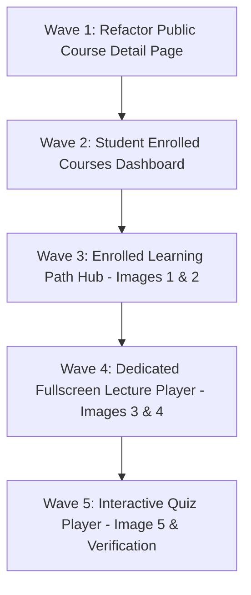

# Phase 06: Dedicated Learning Player, Learning Path Hub & LinkedIn-Learning-Style Quiz

**Phase Status:** Ready for Execution  
**References Provided:** 5 UI Screenshots from LinkedIn Learning / Microsoft Professional Certificate:
1. *Image 1:* Professional Certificate Header, Progress Bar, Resume Button, Partner Box & Hero Preview.
2. *Image 2:* Content in this Learning Path vertical connected timeline with module cards.
3. *Image 3:* Dedicated Fullscreen Lecture Player with Collapsible Left Content Drawer, Video Player, and Overview / Notebook / Transcript Tabs.
4. *Image 4:* "Practice while you learn with exercise files" Download Modal.
5. *Image 5:* Interactive Question Evaluation with instant Incorrect (Red) / Correct (Green) indicators and explanation notes.

---

## 1. Objectives & Scope

1. **Streamline Public Course Detail Page (`/courses/[slug]`)**:
   - Remove inline player embedding on the public course page. Keep `/courses/[slug]` as a clean **Course Overview & Syllabus** (Image 1 style).
   - If the user is enrolled, the CTA button becomes `"अध्ययन जारी रखें (Resume Learning)"`, routing to `/courses/[slug]/learn`.
2. **Student Dashboard: Enrolled Courses List (`/dashboard/courses`)**:
   - Add a dedicated student view in the dashboard displaying all active enrolled courses with real-time progress bars, completion % and quick "Resume" jump links.
3. **Enrolled Learning Path Hub (`/dashboard/courses/[slug]`)**:
   - Replicate **Image 1 & Image 2**:
     - Professional Certificate header banner ("Career Essentials... / प्रमाणित आजीविका उद्यम").
     - 4-metric stats (Total duration, module count, level, updated date).
     - Live progress bar (`X hours / Y lessons left`).
     - Big `[Resume / अध्ययन जारी रखें]` CTA with Bookmark & Share actions.
     - "Earn a Professional Certificate" institutional partnership box (DIC Khandwa, NABARD).
     - "Content in this Learning Path" vertical connected timeline (Image 2) with duration badges and progress bars per course item.
4. **Dedicated Fullscreen Video Lecture Player (`/courses/[slug]/learn`)**:
   - Replicate **Image 3 & Image 4**:
     - Left collapsible sidebar drawer (`Contents` with toggle button & `← BACK TO LEARNING PATH` navigation).
     - Accordion modules with lesson types (Video, Text, Quiz, Resource), duration, bookmark, and green checkmark for completed items.
     - Active lesson highlighted in sleek black background (`bg-slate-900 text-white`).
     - HD Video Player with subtitle overlay and player controls.
     - Tabbed footer interface:
       - **[Overview]**: Lesson description, Instructor profile card (Avatar, name, role, bio), and "Related to this course" section.
       - **[Notebook]**: Interactive student notes scratchpad with local/saved state.
       - **[Transcript]**: Bilingual Hindi/English lesson transcript and key points.
     - Exercise files modal (Image 4): "Practice while you learn with exercise files" for DPR calculators, Excel workbooks, and guides.
     - Automatic lesson completion tracking via `POST /api/progress`.
5. **Interactive Assessment & Chapter Quiz Player**:
   - Replicate **Image 5**:
     - Question progression: "Question X of Y".
     - Radio selection for options.
     - Instant verification feedback:
       - **Incorrect (Red)** with explanation note on why it was wrong.
       - **Correct (Green)** with explanation note explaining the rationale.
     - Score tally and passing threshold (e.g., 70%).
     - Automatically submits results to `POST /api/quizzes/[id]/attempts`, records completion in `POST /api/progress`, and unlocks certificates upon passing.

---

## 2. Wave Breakdown & Architecture

### Wave 1: Clean Public Course Overview (`/courses/[slug]`)
- **File:** [`app/courses/[slug]/page.tsx`](file:///e:/Repository/chhaigaon_udyami/chhaigaon_udyami/app/courses/[slug]/page.tsx)
- **Changes:**
  - Ensure public view displays curriculum syllabus (accordion overview with preview indicators).
  - When user is enrolled, the Primary CTA and Floating Card button say `"अध्ययन जारी रखें (Resume Learning)"` and link directly to `/courses/[slug]/learn`.
  - Remove embedded video player from public syllabus so public page stays purely an overview.

### Wave 2: Student Enrolled Courses Dashboard (`/dashboard/courses`)
- **File:** `app/dashboard/courses/page.tsx` (New)
- **Changes:**
  - Authenticated student page fetching user enrollments from `prisma.enrollment` with course details and progress.
  - Displays grid of enrolled courses with progress bars, completed lessons count, last accessed date, and `Resume` button.
  - Updates [`components/dashboard/app-sidebar.tsx`](file:///e:/Repository/chhaigaon_udyami/chhaigaon_udyami/components/dashboard/app-sidebar.tsx) to point `मेरे कोर्सेस (Courses)` to `/dashboard/courses`.

### Wave 3: Enrolled Learning Path Hub (Images 1 & 2 Reference)
- **File:** `app/dashboard/courses/[slug]/page.tsx` (New)
- **Features:**
  - Top Hero Banner matching **Image 1**: "Professional Certificate" badge, Course title, duration, items count, "In partnership with DIC Khandwa & NABARD", learner count, and short summary.
  - Progress bar with estimated time remaining and percentage complete.
  - Blue `[Resume / अध्ययन जारी रखें]` button, bookmark and share buttons.
  - Hero right video preview thumbnail with subtitle quote and next lecture prompt.
  - "Earn a Professional Certificate" institutional verification box.
  - "Content in this Learning Path" vertical connected timeline matching **Image 2**:
    - Timeline connector line with circle indicators.
    - Module cards with duration, instructor/publisher tag, progress bar, learner count, and description.

### Wave 4: Dedicated Fullscreen Video Lecture Player (Images 3 & 4 Reference)
- **Files:**
  - `app/courses/[slug]/learn/page.tsx` (New)
  - `components/course/dedicated-learning-player.tsx` (New)
  - `components/course/exercise-files-modal.tsx` (New - Image 4)
- **Features:**
  - Collapsible left sidebar with `← BACK TO LEARNING PATH` navigation.
  - Module playlist with active lesson highlighted in dark theme (`bg-slate-900 text-white`), duration badges, and green completion checkmarks.
  - Large HD Video player with subtitle overlay.
  - Three-tab interface below video:
    - **Overview**: Description, takeaways, Instructor card (Avatar, name, bio), and "Related to this course" (Exercise Files, Certificates, Organizations).
    - **Notebook**: Scratchpad for student notes with auto-save.
    - **Transcript**: Lesson transcript text.
  - Exercise files modal (Image 4): download buttons for DPR Excel sheets and PDF guides.
  - Next / Previous navigation controls and automatic lesson progress tracking (`POST /api/progress`).

### Wave 5: Interactive Quiz Player & Answer Evaluation (Image 5 Reference)
- **Files:**
  - `components/course/interactive-quiz-view.tsx` (New - Image 5)
  - Integration within `dedicated-learning-player.tsx` for quiz items.
- **Features:**
  - Replicates **Image 5** exactly:
    - "Question X of Y" counter.
    - Option radios with selection state.
    - Answer validation showing:
      - 🔴 **Incorrect** with contextual explanation of why it was wrong.
      - 🟢 **Correct** with detailed rationale.
    - Scoring summary and passing threshold calculation.
    - Submits attempt to `POST /api/quizzes/[id]/attempts`.
    - Automatically updates progress in `POST /api/progress` when passed.
- **Verification:** End-to-end testing with TypeScript compile, Next.js build check, and manual verification of routes.
